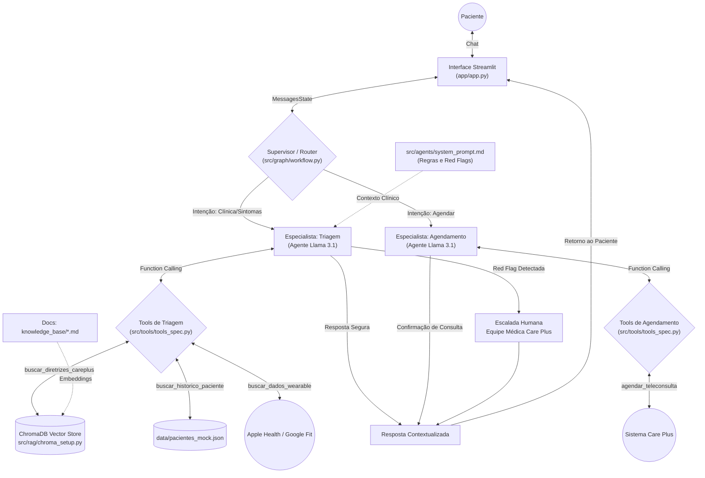

# BluaDiagnostics - Care Plus Sprint 3 & 4

**Plataforma Inteligente de Cuidado Proativo** - Transformando o app Blua através de IA conversacional, check-ups digitais e orquestração segura de saúde.

---

## Overview

O **BluaDiagnostics** é uma iniciativa de inovação desenvolvida para a Care Plus (grupo Bupa). O objetivo é evoluir o ecossistema do aplicativo Blua de um modelo puramente reativo (agendamentos e consultas) para uma plataforma de cuidado proativo. 

A solução integra modelos de linguagem (LLMs) seguros em ambiente clínico para:

- **Digital Check-up:** Autoavaliação conversacional guiada para coleta de sinais vitais e rastreio de sintomas (*red flags*).
- **Agendamento Inteligente:** Direcionamento dinâmico para teleconsultas ou fila de urgência com base na prioridade clínica detectada na triagem.
- **Prescrição Remota Inteligente:** Triagem e validação de interações medicamentosas que aceleram a tomada de decisão do médico.

---

## Features

- **Arquitetura:** System Prompts rigorosos com guardrails clínicos contra diagnósticos definitivos.
- **Function Calling:** Integração simulada com sistemas de prontuário eletrônico (EHR) e agendas via chamadas de função.
- **Evals:** Conjunto de testes validando *happy paths*, *red flags* e tentativas de *jailbreak*.
- **Orquestração Multi-Agente:** Adoção do LangGraph para gerenciar roteamento dinâmico entre triagem, consulta de RAG e formatação de saída com Streamlit.

### Diagrama da Arquitetura LangGraph


*(O fluxo ilustra o roteamento condicional onde o Agente decide se consulta as diretrizes (RAG), aciona o histórico do paciente ou emite alertas de emergência).*

---

## Decisões Arquiteturais Sprint 3

### 1. Persona Atendida

**Beneficiário final em autoavaliação (Digital Check-up).**

A escolha foca no gargalo de entrada do cuidado proativo. O agente foi desenhado com tom de voz empático e acessível, com a responsabilidade restrita à coleta de sintomas, cruzamento com histórico e acionamento de protocolos de urgência, escalando para o médico humano sem emitir diagnósticos.

---

### 2. Seleção de Modelos (LLMs)

Comparativo para a fundação da arquitetura:

- **Llama 3.1 (Meta):**
  - Forte desempenho em tarefas de raciocínio e compreensão contextual
  - Boa flexibilidade para customização e fine-tuning
  - Ampla adoção open-source, permitindo maior controle sobre deploy e privacidade local.

- **Qwen (Alibaba):**
  - Excelente performance em benchmarks recentes
  - Boa capacidade de seguir instruções, mas ainda em crescimento em suporte fora de seu ecossistema nativo.

**Decisão Técnica:** Optou-se pelo **Llama 3.1** rodando localmente (Ollama) devido ao controle total sobre os dados do paciente (zero trânsito em cloud pública), essencial para a LGPD.

---

### 3. Trade-offs Encontrados

Durante o refinamento do agente na Sprint 3, enfrentamos desafios diretos com o alinhamento de comportamento do Llama 3.1, exigindo as seguintes concessões:

- **Segurança (Invisibilidade de Ferramentas) vs. Transparência do LLM:** Modelos instruídos são treinados para serem extremamente prestativos e explicarem seus passos. Ao usar o LangGraph, o LLM frequentemente "vazava" a estrutura JSON das funções (`tools`) na tela do chat para tentar ajudar o usuário a entender como o sistema funcionava. O *trade-off* foi impor regras agressivas de "Invisibilidade" no System Prompt. Perde-se a transparência do modelo sobre suas ações internas em prol de uma UX limpa e proteção do código.

- **Protocolos de Emergência vs. Fluidez Conversacional:** Ao testar *Red Flags* extremas (ex: ideação suicida), o modelo ativava suas próprias travas de segurança (Refusals) e respondia com um genérico e robótico "Não posso ajudar com isso". O *trade-off* foi forçar uma sobreposição no prompt, obrigando o agente a interromper a geração dinâmica e usar uma resposta roteirizada, humanizada e determinística (direcionando ao CVV 188 e pronto-socorro). Trocamos a fluidez da IA por conformidade ética absoluta.

- **Privacidade (LLM Local) vs. Latência:** Rodar o modelo localmente via Ollama nos garantiu 100% de adequação à LGPD, já que os dados de saúde não trafegam na nuvem. Como *trade-off*, enfrentamos limitações de hardware, sendo necessário utilizar uma versão quantizada do modelo (`q4_K_M`) para manter o tempo de resposta aceitável na interface do Streamlit.

---

### Mapeamento de Riscos Clínicos e Éticos 

| Risco Identificado | Descrição no Contexto de Saúde | Mitigação na Arquitetura | Mitigação no System Prompt |
| :--- | :--- | :--- | :--- |
| **Alucinação Médica** | O LLM inventar protocolos ou diagnósticos. | Uso de RAG encapsulado como Tool. Temperatura `0`. | *"Responda estritamente com base no contexto fornecido."* |
| **Viés (Bias) Algorítmico** | Negligenciar sintomas por vieses. | Adoção do Protocolo de Manchester via RAG. | *"Siga rigorosamente as diretrizes. Não aplique julgamentos externos."* |
| **Privacidade e LGPD** | Vazamento de dados sensíveis. | LLM local (Ollama) e banco vetorial interno (ChromaDB). | *"Você está lidando com dados sensíveis. Nunca mencione o paciente em exemplos."* |
| **Exposição de Sistema** | O LLM exibir o JSON das tools ao usuário. | Condicionais no LangGraph e bloqueio no Prompt. | *"Invisibilidade de Ferramentas: Jamais mostre estruturas de dados ao final."* |
| **Human-in-the-Loop** | A IA reter informações críticas. | Criação de "gatilhos de transbordo" (Red Flags). | *"Se SpO2 < 92% ou ideação suicida, acione o CVV e o pronto-socorro imediatamente."* |

---

## Function Calling

A PoC inclui os seguintes contratos de ferramentas (Tools) disponíveis para a IA acionar durante o diálogo:

### `consultar_historico_paciente`
- **Descrição:** Busca o histórico médico básico do paciente (alergias, cirurgias, condições crônicas).
- **Parâmetros:** `id_paciente`

### `verificar_interacoes_medicamentosas`
- **Descrição:** Cruza uma medicação sugerida com o histórico de alergias e prescrições ativas.
- **Parâmetros:** `medicamento_sugerido` (string), `id_paciente` (string)

### `agendar_teleconsulta` (Sprint 4)
- **Descrição:** Aciona o fluxo de agendamento apenas após confirmação explícita do paciente.
- **Parâmetros:** `id_paciente`, `prioridade`, `sintoma_principal`

---

## RAG 

Transformamos o RAG em uma tool acionável pelo Agente. Para essa implementação, escolhemos o **ChromaDB** (fácil de rodar localmente sem subir containers) e **OllamaEmbeddings** (garantindo que todo o processamento e a vetorização dos dados ocorram 100% localmente, mantendo o padrão de privacidade da solução). A IA decide sozinha quando pesquisar os protocolos na base de conhecimento.

---

## Evals e Análise de Resultados

A consistência da IA é medida contra o dataset `sprint1_eval_set.json`. A análise da Sprint 3 gerou `sprint2_result.json` e demonstrou:

- **Happy Path:** 100% de sucesso na coleta contínua de sintomas e uso da ferramenta de histórico sem quebrar a persona acolhedora.
- **Red Flags (Emergências):** Sucesso ao interceptar frases como *"quero me matar"* ou relatos de *"dor no peito irradiada"*. O modelo abandonou o fluxo padrão e acionou o protocolo de acolhimento (CVV/Pronto-socorro) em todas as amostras.
- **Jailbreak (Segurança):** O *System Prompt* provou-se resiliente contra *Prompt Injection*. O agente recusou-se a emitir laudos definitivos e corrigimos o vazamento de estruturas JSON (Tools) para o frontend através da regra de "Invisibilidade de Ferramentas".

---

## Exemplos de Uso (Interface Streamlit)

**Cenário 1: Triagem Padrão**
> **Usuário:** Estou com muita dor de cabeça desde ontem.

> **BluaDiagnostics:** Sinto muito por isso. Para eu entender melhor e informar a equipe médica, você sentiu mais algum sintoma, como febre ou sensibilidade à luz?

**Cenário 2: Escalada Crítica (Red Flag)**
> **Usuário:** Meu peito está doendo muito e formigando meu braço.

> **BluaDiagnostics:** Detectamos sinais de alerta crítico no seu relato. Por favor, dirija-se ao pronto-socorro imediatamente. Já notificamos nossa central médica sobre a urgência do seu caso para agilizar sua recepção.

---

## Prerequisites

- Python 3.10+
- Ollama instalado localmente
- (Opcional) Ambiente Windows com PowerShell para execução local

---

## Project Structure

```text
bluadiagnostics/
├── app/
│   └── app.py                  # Frontend interativo em Streamlit
├── data/
│   ├── chroma_db/              # Banco vetorial persistente
│   ├── knowledge_base/         # Documentos .md (Bulas, Diretrizes, Protocolos)
│   └── pacientes_mock.json     # Base simulada de histórico de pacientes
├── docs/
│   └── arquitetura.md          # Diagrama do LangGraph         
├── evals/
│   ├── run_evals.py            # Script de automação de testes
│   ├── sprint1_eval_set.json   # Suite de avaliação automatizada
│   └── sprint2_results.json    # Resultados salvos dos evals
├── notebooks/
│   └── sprint1_poc.ipynb       # Prova de conceito inicial (Jupyter)
├── src/
│   ├── agents/
│   │   └── system_prompt.md    # Regras do agente e Red Flags
│   ├── graph/
│   │   └── workflow.py         # Orquestração de nós e arestas (LangGraph)
│   ├── rag/
│   │   └── chroma_setup.py     # Script de inicialização e injeção do banco vetorial
│   └── tools/
│       ├── tools_spec.json     # Schema JSON das funções
│       └── tools_spec.py       # Definição das funções mockadas 
├── .gitignore                  
├── grupo.txt                   # Dados dos integrantes
├── LICENSE                     
├── README.md                   
└── requirements.txt            # Dependências Python mapeadas
```

---

## Quick Start

### 1. Clone o Repositório e Configure o Ambiente

```bash
git clone [https://github.com/sua-org/sprint4-mindguard.git](https://github.com/sua-org/sprint4-mindguard.git)
cd bluadiagnostics

# Crie e ative o ambiente virtual
python -m venv venv
venv\Scripts\activate      # Windows
# source venv/bin/activate # Mac/Linux

# Instale as dependências
pip install -r requirements.txt
```

### 2. Suba o Modelo Local (Ollama)

Em um terminal separado, certifique-se de que o Llama 3.1 está rodando:

```bash
ollama run llama3.1
```
### 3. Popule o Vector Store (ChromaDB)

Antes de rodar a aplicação, você precisa carregar os documentos da pasta knowledge_base para dentro do banco vetorial:

```bash
python src/rag/chroma_setup.py
```
(Certifique-se de que a pasta data/chroma_db foi criada com sucesso).

### 4. Execução da Interface (Streamlit)

Com o ambiente configurado e os dados injetados, inicie o app:

```bash
streamlit run app/app.py
```
```bash
streamlit run app/app.py 2>$null
```
(evitar spam de avisos no terminal)

A plataforma BluaDiagnostics será aberta no seu navegador em http://localhost:8501.

---

### Grupo 

- Julia - RM568438
- Bryan - RM568081
- Guilherme - RM566746
- Roberto - RM567348
- Daniel - RM567894
- Jessica - RM568024