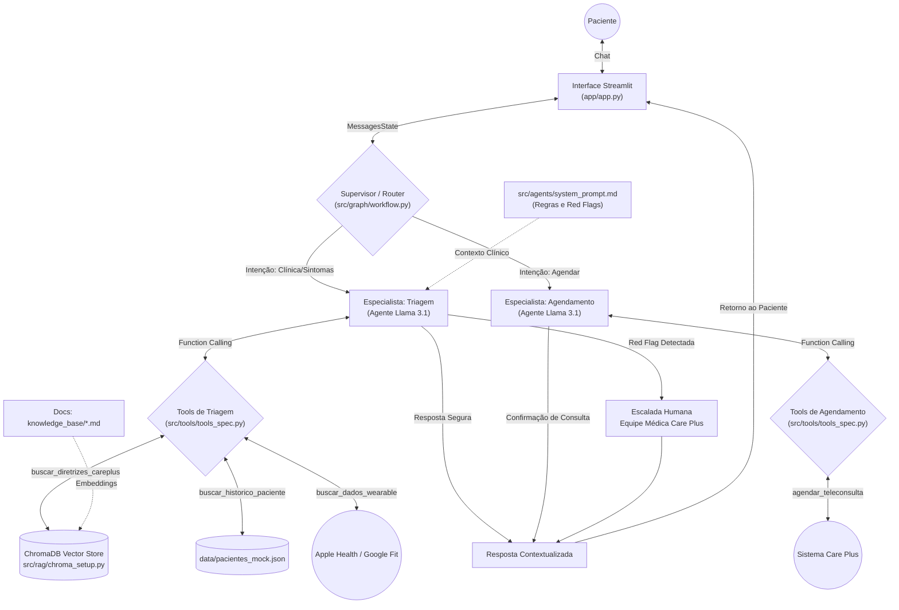

```mermaid
flowchart TD
    %% 1. User Interaction
    User((Paciente)) <-->|Chat| App["Interface Streamlit<br>(app/app.py)"]

    %% 2. LangGraph Entry
    App <-->|MessagesState| Supervisor{"Supervisor / Router<br>(src/graph/workflow.py)"}

    %% 3. Multi-Agent Routing (Llama 3.1)
    Supervisor -->|Intenção: Clínica/Sintomas| AgenteTriagem["Especialista: Triagem<br>(Agente Llama 3.1)"]
    Supervisor -->|Intenção: Agendar| AgenteAgendamento["Especialista: Agendamento<br>(Agente Llama 3.1)"]

    %% 4. System Prompt & Guardrails
    SysPrompt["src/agents/system_prompt.md<br>(Regras e Red Flags)"] -.->|Contexto Clínico| AgenteTriagem

    %% 5. Tools - Agente de Triagem
    AgenteTriagem <-->|Function Calling| ToolsTriagem{"Tools de Triagem<br>(src/tools/tools_spec.py)"}
    
    ToolsTriagem <-->|buscar_diretrizes_careplus| RAG[(ChromaDB Vector Store<br>src/rag/chroma_setup.py)]
    ToolsTriagem <-->|buscar_historico_paciente| MockDB[(data/pacientes_mock.json)]
    ToolsTriagem <-->|buscar_dados_wearable| Wearable((Apple Health / Google Fit))

    %% Ingestão RAG (Background)
    KB_Docs[Docs: knowledge_base/*.md] -.->|Embeddings| RAG

    %% 6. Tools - Agente de Agendamento
    AgenteAgendamento <-->|Function Calling| ToolsAgendamento{"Tools de Agendamento<br>(src/tools/tools_spec.py)"}
    ToolsAgendamento <-->|agendar_teleconsulta| Agenda((Sistema Care Plus))

    %% 7. Resposta e Escalada
    AgenteTriagem -->|Red Flag Detectada| Escalada["Escalada Humana<br>Equipe Médica Care Plus"]
    AgenteTriagem -->|Resposta Segura| Output[Resposta Contextualizada]
    AgenteAgendamento -->|Confirmação de Consulta| Output
    
    Escalada --> Output
    Output -->|Retorno ao Paciente| App
```
