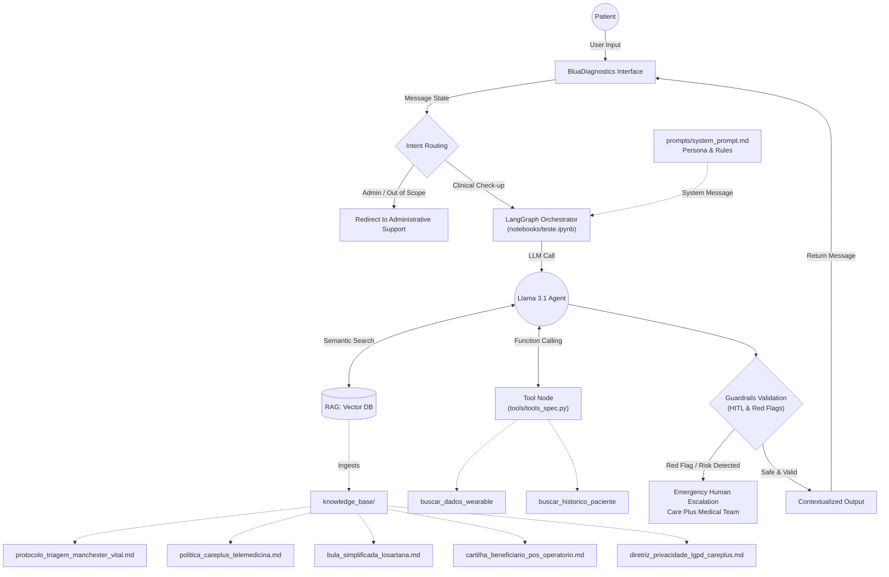

```mermaid
flowchart TD
    %% 1. User Input
    User((Patient)) -->|User Input| App[BluaDiagnostics Interface]
    App -->|Message State| Router{Intent Routing}

    %% 2. Intent Routing (Based on sprint1_eval_set.json & system_prompt.md)
    Router -->|Admin / Out of Scope| Admin[Redirect to Administrative Support]
    Router -->|Clinical Check-up| Orchestrator["LangGraph Orchestrator<br>(notebooks/teste.ipynb)"]

    %% 3. LLM Call
    SysPrompt["prompts/system_prompt.md<br>Persona & Rules"] -.->|System Message| Orchestrator
    Orchestrator -->|LLM Call| LLM((Llama 3.1 Agent))

    %% 4. RAG Consultation
    LLM <-->|Semantic Search| RAG[(RAG: Vector DB)]
    RAG -.->|Ingests| KB_Docs[knowledge_base/]
    KB_Docs -.-> KB1[protocolo_triagem_manchester_vital.md]
    KB_Docs -.-> KB2[politica_careplus_telemedicina.md]
    KB_Docs -.-> KB3[bula_simplificada_losartana.md]
    KB_Docs -.-> KB4[cartilha_beneficiario_pos_operatorio.md]
    KB_Docs -.-> KB5[diretriz_privacidade_lgpd_careplus.md]

    %% 5. Tools Invocation
    LLM <-->|Function Calling| ToolNode["Tool Node<br>(tools/tools_spec.py)"]
    ToolNode -.-> T1[buscar_dados_wearable]
    ToolNode -.-> T2[buscar_historico_paciente]

    %% 6. Guardrails Validation
    LLM --> Guardrails{"Guardrails Validation<br>(HITL & Red Flags)"}
    Guardrails -->|Red Flag / Risk Detected| Escalate["Emergency Human Escalation<br>Care Plus Medical Team"]
    
    %% 7. Contextualized Output
    Guardrails -->|Safe & Valid| Output[Contextualized Output]
    Output -->|Return Message| App
```
